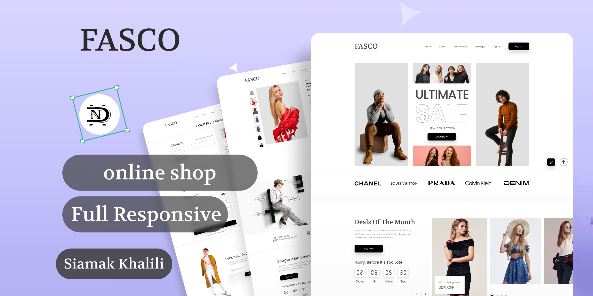

# 🛍️ Online Shop

A modern, fully responsive clothing e-commerce website built using **HTML**, **CSS**, and **JavaScript**.  
This project includes essential e-commerce features such as product listing with filtering and sorting, a dynamic cart system, product details, and a checkout page — all powered by a local `json-server` API and enhanced by libraries like **Swiper** and **Axios**.

---

## 📌 Features

- 🛒 **Product Catalog** with advanced filtering and sorting (by color, size, price, brand, tags)
- 🧺 **Cart System** with quantity management and delete functionality
- 💾 **Persistent Cart** using `LocalStorage`
- 👕 **Single Product Page** showing images, sizes, colors, and rating
- 🔐 **Simple Sign Up / Sign In Forms** (non-functional, for UI purposes only)
- 💳 **Checkout Page** with shipping form
- 🎯 **Swiper Slider** for featured discounted products
- 🔍 **Live Search** functionality
- 📱 **Fully Responsive Design** for desktop and mobile
- 🧩 **Modular Components** for header and footer
- 🌐 Powered by **json-server** for dynamic product data

---

## 📁 Folder Structure

Online-Shop/
│
├── index.html # Homepage (hero slider, brands, featured offers)
├── shop.html # Product listing with filters & sorting
├── single-product.html # Product detail view
├── signup.html # Sign up form (UI only)
├── signin.html # Sign in form (UI only)
├── checkout.html # Shipping & payment info
│
├── css/ # CSS styles and fonts
├── js/ # JavaScript logic (main.js, home.js, etc.)
├── components/ # Reusable components (header & footer)
├── assets/ # Product images, icons, fonts
│
├── db.json # Product database for json-server
├── package.json # Project dependencies & scripts
└── server.js # (empty - optional for backend extension)

yaml
Copy
Edit

---

## 🧰 Tech Stack & Dependencies

- HTML5 / CSS3 / JavaScript (Vanilla)
- [Swiper](https://swiperjs.com/) – for responsive sliders
- [Axios](https://axios-http.com/) – for API requests
- [json-server](https://github.com/typicode/json-server) – local fake REST API

---

##📷 Screenshots


## 🚀 Getting Started

### 1. Clone the Repository
```bash
git clone https://github.com/Siamak-Khalili/Online-Shop.git
cd Online-Shop
2. Install Dependencies
Make sure you have npm installed, then run:

bash
Copy
Edit
npm install
3. Start json-server
bash
Copy
Edit
npx json-server --watch db.json
4. Open the Website
Open index.html in your browser (you can use Live Server for easier development).


🔧 Future Improvements
Add full authentication and user accounts

Implement order history and validation

Backend integration with Express or other frameworks

Product review and rating system

📄 License
This project is for educational and practice purposes. Feel free to fork and modify it for your own learning.
